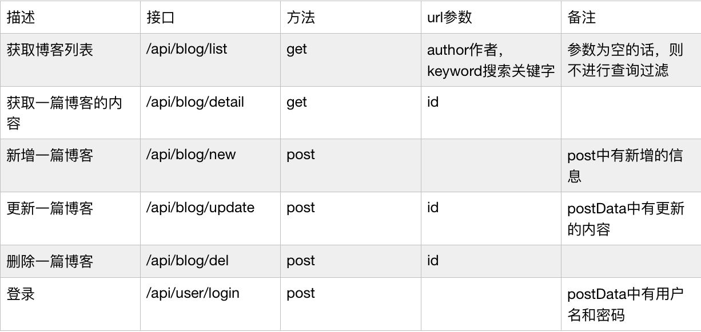
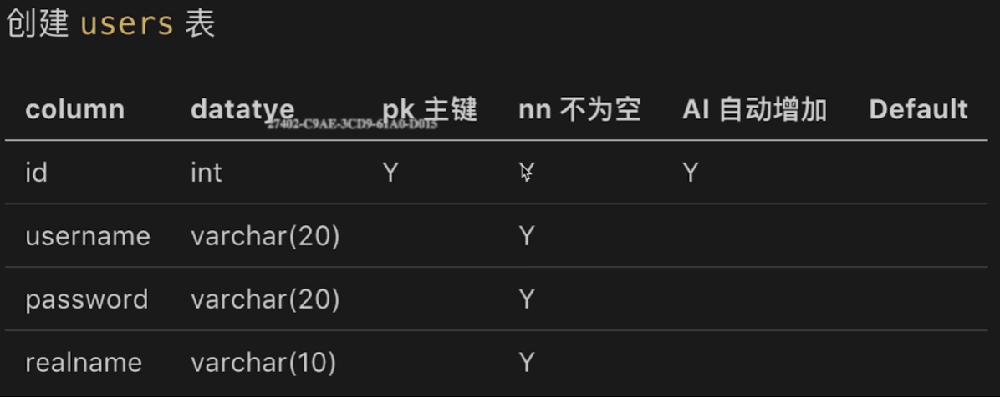
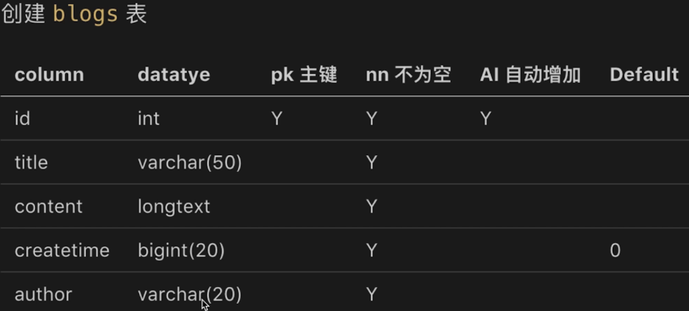
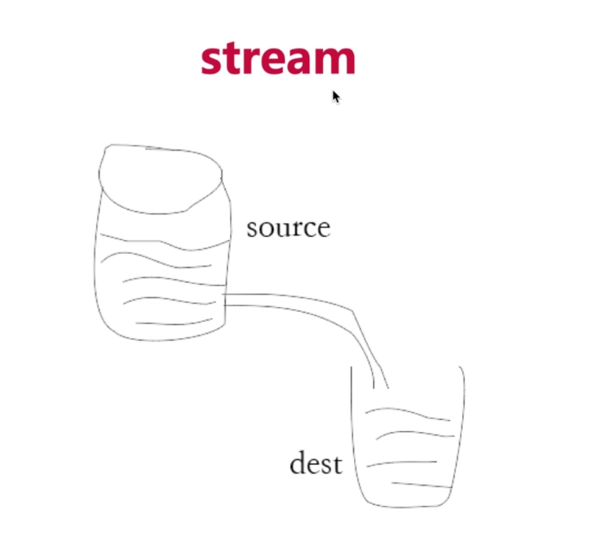

# Node后台博客

## 实现功能
- 首页
- 博客详情页
- 登录页
- 管理中心
- 新建页
- 编辑页

## 技术栈
* node（主干）
* nginx（反向代理）
* mysql（数据库）
* morgan（日志）
* redis（存储session）
* xss（xss攻击）
* readline（日志分析）
* crontab（定时任务）

## 项目运行（已安装nginx、redis、mysql）
1. `npm install`
2. 启动mysql
3. `brew services start nginx` 开启nginx
4. `npm install http-server -g`
5. `cd static/html & http-server -p 9002`代理前端静态页面
6. `cd ../.. & npm run dev`

## 项目目录结构
```
- bin（服务）
- demo（测试用例）
- log（morgan日志）
  - access（fs、path实现日志）
  - 
- src（项目代码）
  - conf（mySQL和Redis连接配置）
  - controller（sql查询）
    - blog（博客sql）
    - user（用户）
  - db（数据库）
    - mysql
    - redis
  - model（response消息模板）
  - router（路由）
  - static
    - html（前端页面）
  - utils（工具）
    - crop（密码加密）
- app（main.js）
- nginx.conf（nginx配置）
```

## 项目总结

### nodejs
- nodejs是运行在Chrome V8上的JavaScript运行时
- 事件驱动 非阻塞I/O
- I/O密集、高并发处理 Web场景 nodejs性能好
- 常用场景：Web Server、本地代码构建、实用工具开发

### nvm
1. nodeJs版本管理工具，可切换多个nodeJS版本
2. Mac OS系统,使用`brew install nvm`安装
3. Window系统,github中搜索nvm-windows,里边有下载地址
4. 常用命令
  - nvm list 查看当前所有的node版本
  - nvm install v10.13.0  安装指定版本
  - nvm use --delete-prefix 10.13.0 切换到指定版本

### ECMAScript、js和nodejs关系
1. ECMAScript
  - 定义了语法，写js和nodejs都必须遵守
  - 定义变量、循环、判断、函数、原型和原型链、作用域和闭包、异步
  - 具体内容可参考阮一峰ES6
  - 不能操作DOM，不能监听click事件，不能发送ajax请求
  - 不能处理http请求，不能操作文件
  - 即，只有ECMAScript，几乎做不了任何实际的项目
2. js
  - 使用ECMAScript语法规范，外加Web API,缺一不可
  - DOM操作，BOM操作，事件绑定，Ajax等
  - 两者结合，即可完成浏览器端的任何操作
3. nodejs
  - 使用ECMAScript，外加nodejs API,缺一不可
  - 具体可参考http://nodejs.cn/api
  - 两者结合，即可完成server端的任何操作
4. 总结
  - ECMAScript是语法规范
  - nodejs = ECMAScript + nodejs API 
  - js = ECMAScript + Web API 

### 后端开发和前端开发的区别

1. 服务稳定性
  - server端可能会遭受各种恶意攻击和误操作
  - 单个客户端可以意外挂掉，但是服务端不能
  - 使用PM2做进程守护（进程挂掉之后自动重启）

2. 考虑内存和CPU（优化、扩展）
  - 客户端独占一个浏览器，内存和CPU都不是问题
  - server端要承载很多请求，CPU和内存都是稀缺资源
  - 使用stream写日志(优化)，使用redis存session(扩展)

3. 日志记录
  - 前端也会参与写日志，但只是日志的发起方，不关心后续
  - server端要记录日志、存储日志、分析日志，前端不关心
  - 多种日志记录方式，以及如何分析日志

4. 安全
  - server端要随时转呗接受各种恶意攻击，前端则少很多
  - 如：越权操作，数据库攻击等
  - 登录验证，预防xss攻击和sql注入

5. 集群和服务拆分（流量过大时）
  - 产品发展速度快，流量可能会迅速增加
  - 如何通过扩展机器和服务拆分来承载大流量？
  - 本课程是单机器开发，但是从设计上支持服务拆分

### 接口设计


### 从浏览器输入一个url，会发生什么？
1. 客户端进行DNS解析，建立TCP连接，发送http请求
2. server接收http请求，处理，并返回
3. 客户端接收到返回数据，处理数据（如渲染页面，执行js）

### mysql workbench
- 操作mysql的客户端，可视化操作
- 下载：https://dev.mysql.com/downloads/workbench/
- information_schema、performance_schema、mysql、sys四个数据库为系统自带的mysql数据库，不要删除

### 数据库操作
1. 建库
  - 创建myblog数据库
  - show databases;进行验证
2. 建表
  - 
  - 

### 登录相关的cookie、session、redis
1. cookie 
 - 存储在浏览器的一段字符串（最大5Kb）
 - 跨域不共享
 - 格式k1=v1;k2=v2;因此可以存储结构化数据
 - 每次发送http请求，会将请求域的cookie一起发送给server
 - server可以修改cookie并返回给浏览器
 - 浏览器中也可以通过js修改cookie（有限制）
 - cookie中不能存放用户名、用户密码等比较敏感的信息
2. session 
 - session中可以存放用户名、用户密码等比较敏感的信息，解决cookie的弊端，
 - cookie中存储userid(不敏感)，server端对应username（敏感信息）
 - 实现方式：
  1. 使用js内存变量存储session： 
    - 第一，进程内存有限，访问量过大，内存暴增怎么办？
    - 第二，正式上线运行时多进程，进程之间内存无法共享
  2. 使用redis存储session

3. redis
  - web server最常用的缓存数据库，数据存放在内存中（读取速度贵，硬件贵，一旦断电，数据会丢失）
  - 相比于mysql，访问速度快（内存和硬盘不是一个数量级的）
  - 但是成本更高，可存储的数据量更小（内存的硬伤）
  - 将web server和redis拆分为两个独立的服务
  - 双方都是独立的，都是可扩展的（例如都扩展成集群）
  - （包括mysql，也是一个单独的服务，也可扩展）


4. 为什么session 适合用redis?
  - session访问极其频繁，对性能要求极高
  - session可不考虑断电丢失数据的问题（内存的硬伤）（用户可再次登录）
  - session数据量不会很大（相比于MySQL中存储的数据）
  - redis也可以配置为断电不丢失数据

5. 为何网站数据不适合用redis?
  - 操作频率不是很高（相比于session操作）
  - 断电不能丢失，必须保留
  - 数据量太大，内存成本太高


#### 系统安全
##### XSS：窃取前端的cookie内容
* 攻击方式
  > 在页面展示的内容中掺杂js代码(<script>alert("xss");</script>)，以获取网页信息
* 预防措施（转换生成js的特殊字符）
  ```
    npm i xss --save（通过xss包）
    var xss = require('xss');
    var html = xss('<script>alert("xss");</script>');
    console.log(html);
    // &lt;script&gt;alert("xss");&lt;/script&gt;
  ```

### 日志存放
- 日志要存储到文件中
- 为何不存储到mysql中？
- 不符合mysql中数据结构
- 为何不存储到redis中？
- 日志内容较为庞大（超大系统一天就几个G）
- 速度：redis>mysql>文件
- 成本：redis>mysql>文件

### IO操作的性能瓶颈
- IO包括网络IO和文件IO
- 相比于CPU计算和内存读写，IO突出特点就是：慢！
- 如何在有限的硬件资源下提高IO的操作效率？
- 使用stream来提高IO的操作效率
- 标准输入输出，pipe就是管道
- process.stdin获取数据，直接通过管道传递给process.stdout
- process.stdin.pipe(process.stdout)


### 日志分析
- 日志是按行存储的，一行就是一条日志
- 使用nodejs的readline（基于stream，效率高）

### crontab（定时任务）
- 设置定时任务，格式：*****command
- 分钟-小时-日-月-星期-shell脚本
- 将access.log拷贝并重命名为2019-02-10.access.log
- 清空access.log文件，继续积累日志
- shell脚本比nodejs高效的多
- 0 * * * * sh copy.sh （每天的0点去执行copy.sh）
- crontab -e 编辑任务
- crontab -l 查看有哪些任务


### sq注入：窃取数据库内容
* 最原始、最简单的攻击，从有了web2.0就有了sql注入攻击
* 攻击方式：输入一个sql片段（username '-—' ;delete from users），最终拼接成一段攻击代码
* 预防措施：使用mysql的escape函数处理输入内容即可

### 明文密码加密（md5加密）保障用户信息安全

### 单进程、多进程和redis
* 操作系统会限制一个进程的最大可用内存
* 单进程无法充分利用机器全部内存
* 单进程无法充分利用多核CPU的优势
* 多进程之间，内存无法共享
* 多进程可以通过访问一个redis，实现数据共享


